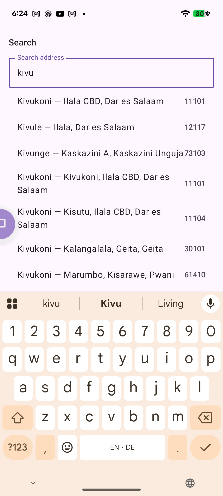
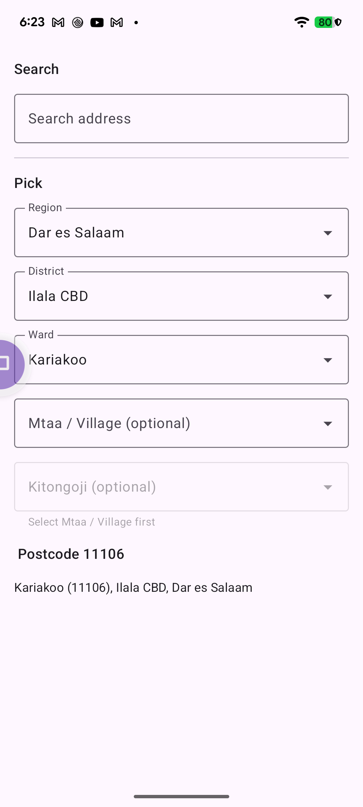
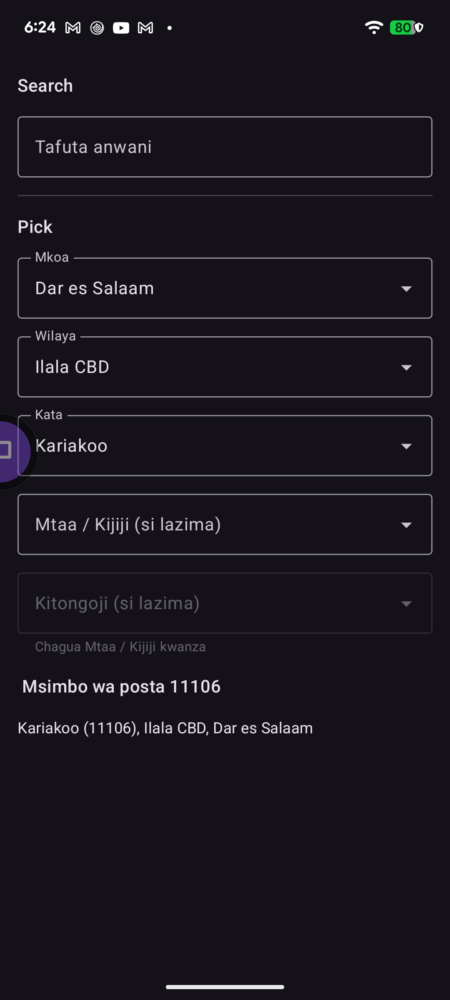

# TZ Address Kit

Offline Tanzanian address data for Kotlin Multiplatform: type-ahead search, postcode lookup and cascading
Region → District → Ward → Mtaa/Village → Kitongoji browsing, with an optional Compose picker.
No network, no API key. The data ships inside the library.

| Search | Picker | Picker (Swahili) |
|---|---|---|
|  |  |  |

## What data it covers

Edition `2012-07-30` of the national postcode list: **30 regions, 163 districts, 3,416 wards (5-digit postcodes),
15,820 mtaa/villages/shehia and 16,883 kitongoji.** Zanzibar's regions are included; a shehia is stored as an mtaa.

Not covered: Songwe (created 2016) and districts created after 2012 such as Kigamboni. The data comes from the publicly available
Tanzanian postcode list (see <https://www.tanzaniapostcode.com/> and
<https://www.tcra.go.tz/services/publication-of-postcode-list>). Details and attribution are in
[DATA_SOURCE.md](DATA_SOURCE.md).

## Artifacts

| Artifact | For | Needs |
|---|---|---|
| `io.github.omarshehe:tz-address-core` | the model and the `AddressRepository` interface | Kotlin 2.2+ (iOS/native: 2.4+) |
| `io.github.omarshehe:tz-address-data` | the bundled database and the repository (includes `core`) | Kotlin 2.2+ (iOS/native: 2.4+) |
| `io.github.omarshehe:tz-address-ui` | `AddressSearchField` and `AddressPicker` (Compose) | Compose Multiplatform 1.12, built with Kotlin 2.4, and [`forminput-compose`](https://github.com/OmarShehe/FormInputs) 2.1.0 (pulled in transitively) |

Targets: Android (minSdk 21 for `core`, **23** for `data` and `ui`, which their dependencies require), JVM 17, iOS (arm64 and
simulator arm64). Backends and headless apps use `core` + `data` and
never pull in Compose.

## Install

**Android**

```kotlin
dependencies {
    implementation("io.github.omarshehe:tz-address-data:0.1.0")
}
```

**Kotlin Multiplatform** (`commonMain` sees the `AddressRepository` interface; each platform creates the store)

```kotlin
kotlin {
    sourceSets {
        commonMain.dependencies {
            implementation("io.github.omarshehe:tz-address-data:0.1.0")
        }
    }
}
```

**JVM backend.** `data` depends on `androidx.sqlite`, which is only hosted on Google's Maven, so add `google()` next to
`mavenCentral()`:

```kotlin
repositories {
    mavenCentral()
    google()
}

dependencies {
    implementation("io.github.omarshehe:tz-address-data:0.1.0")
}
```

**iOS.** The Kotlin artifact has no data inside it, because iOS has no classpath. Download `tz-address.db` and
`tz-address.db.version` from the matching [GitHub release](https://github.com/OmarShehe/TanzaniaPostalCode/releases)
and add both files to your app target (Xcode: *Build Phases → Copy Bundle Resources*). Without them,
`createAddressRepository()` fails with "Bundled resource … not found".

## Use it

Every call is a `suspend` function, so call it from a coroutine (add `org.jetbrains.kotlinx:kotlinx-coroutines-core` if your
project does not already have it). Create the store **once**, share it, and close it when you are done. It holds an open
database connection.

```kotlin
// Android
val addresses: AddressStore = createAddressRepository(context)

// JVM backend: the folder is where the working copy of the database lives
// val addresses: AddressStore = createAddressRepository("/var/lib/myapp/tz-address")

// iOS
// val addresses: AddressStore = createAddressRepository()
```

```kotlin
val hits = addresses.search("kivu")            // ranked suggestions: label, full path, postcode
val ward = addresses.byPostcode("11101")       // AddressPath? (region, district, ward) or null
val wards = addresses.byPrefix("111")          // every ward whose postcode starts with 111
val valid = addresses.isValidPostcode("11101") // true only for ward postcodes in the dataset

val regions = addresses.regions()              // browse, ordered by name
val districts = addresses.districts(regions.first().code)

addresses.close()
```

`search` matches names and ancestor names, ignoring case and apostrophes (`jangombe` finds `Jang'ombe`,
`ilala kariakoo` finds Kariakoo under Ilala). A blank query returns an empty list; `limit` is clamped to 1..100.
The first call installs the bundled database into app storage (about 9 MB); later calls reuse it.

## The Compose picker

```kotlin
implementation("io.github.omarshehe:tz-address-ui:0.1.0")
```

```kotlin
AddressSearchField(
    repository = addresses,
    onSelected = { path -> println(path.ward?.postcode) },
)

var value by remember { mutableStateOf<AddressPath?>(null) }
AddressPicker(
    repository = addresses,
    value = value,
    onValueChange = { value = it },
    requiredLevel = Level.WARD, // null is reported until this level is chosen
)
```

Both widgets use your `MaterialTheme`, ship English and Swahili strings, and survive rotation. A level with nothing
listed in the source (some wards have no mtaa, most mtaa have no kitongoji) shows "None listed" and counts as complete.
The `:app` module is a working sample.

## Platform notes

- **`tz-address-ui` and `forminput-compose`:** the widgets are built on `com.github.OmarShehe:forminput-compose`. Until that artifact is on a public
  repository, publish it first (`./gradlew :forminput-compose:publishToMavenLocal` in the FormInputs repo) and keep `mavenLocal()` in `settings.gradle.kts`.
- **Intel Macs:** the bundled SQLite driver has no macOS x64 binary. The JVM target runs on Linux (x64, arm64),
  Windows x64 and Apple-silicon macOS. On an Intel Mac, develop against Android or run the JVM code in Linux.
- **Android and `tz-address-ui`:** Compose resources are packaged in the library; nothing to configure.
- **Kotlin versions:** on Android and JVM, `core` and `data` are compiled against Kotlin 2.2 APIs so 2.2+ consumers can use
  them. iOS/native libraries (klibs) are stamped with the compiler that built them (2.4.20), so iOS consumers need Kotlin 2.4+.
  `ui` needs a matching recent Kotlin with the Compose plugin.

## Updating the dataset

The dataset is regenerated from the published postcode list (download it from the references in
[DATA_SOURCE.md](DATA_SOURCE.md)), never edited by hand.

```
./gradlew :importer:importPostcodes -Ppdf=/path/to/postcode-list -PsourceEdition="<label>"
```

This rewrites `dataset/tz-address.json`, `dataset/import-report.md` and `dataset/import-anomalies.csv` and fails on bad
postcodes, duplicates or too many parse anomalies. The bundled database is built from that file at build time
(`./gradlew :data:generateAddressDb`, which also checks its table counts against the report). Then bump `VERSION_NAME`
in `gradle.properties` and add a `CHANGELOG.md` entry.

## Versioning

- **MAJOR:** breaking API change, or ids (`Mtaa.id`, `Kitongoji.id`) changing for existing places.
- **MINOR:** new API, or a **new dataset edition**.
- **PATCH:** data corrections that do not change ids.

Each release records the artifact version and the dataset (`DatasetInfo.version`, source edition) in
[CHANGELOG.md](CHANGELOG.md); at runtime `addresses.info()` returns the same.

## Building and releasing

- `./gradlew :core:jvmTest :data:jvmTest :ui:jvmTest` runs the unit and desktop UI tests; `./gradlew :app:connectedDebugAndroidTest`
  runs both widgets over the real database on a device.
- `./gradlew publishToMavenLocal` publishes `core`, `data` and `ui` to `~/.m2` for trying them in another project
  (`mavenLocal()` first in its repositories).
- Releases are made by pushing a `v*` tag; the workflow in `.github/workflows/release.yml` refuses to publish without
  signing secrets and a `LICENSE`, and while `DATA_SOURCE.md` contains a `TODO(maintainer)` marker. `:app` and `:importer` are never published.
- The workflow **stages** the deployment on Maven Central. Open the Central Portal → *Deployments* and press *Publish* to
  release it (or use `publishToMavenCentral(automaticRelease = true)` to skip that step once you trust the pipeline).

## Licence

Code: [Apache License 2.0](LICENSE). The address data comes from a public postcode list (see [DATA_SOURCE.md](DATA_SOURCE.md)).
